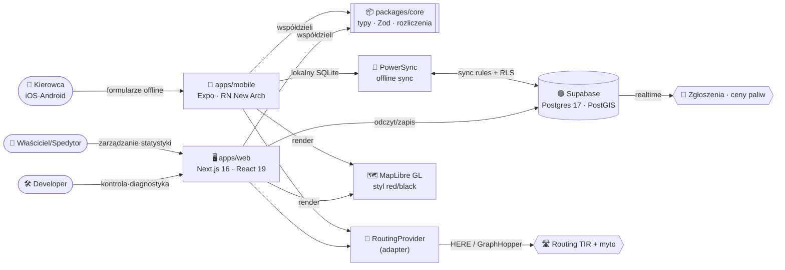

<!-- SYNC: v0.71.0 · #095 · 2026-06-22 — utrzymywane ręcznie do czasu `pnpm docs:check` (badge wersji + blurb „Najnowsze") -->
<!-- ╔══════════════════════════════════════════════════════════════════╗ -->
<!-- ║                       E - L O G I S T I C                         ║ -->
<!-- ╚══════════════════════════════════════════════════════════════════╝ -->

<div align="center">

# 🚛 E‑LOGISTIC &nbsp;·&nbsp; GH0ST EMPIRE

### ⟣ Platforma dla kierowców, spedytorów i firm transportowych ⟣
### ⟣ Web · iOS · Android · macOS — offline-first ⟣

<br/>


<br/>

**[ ▶ Demo na żywo » e-logistic-one.vercel.app ](https://e-logistic-one.vercel.app)** &nbsp;·&nbsp; **[ ☁️ Wdrożenie »](DEPLOY.md)**

<br/>

**[ 🧠 Architektura »](docs/ARCHITECTURE.md)** &nbsp;·&nbsp;
**[ 🗺️ Roadmapa »](docs/ROADMAP.md)** &nbsp;·&nbsp;
**[ 🧱 Model danych »](docs/DATA-MODEL.md)** &nbsp;·&nbsp;
**[ 📐 Analiza/Right-sizing »](docs/ANALIZA.md)** &nbsp;·&nbsp;
**[ 📜 Changelog »](CHANGELOG.md)**

</div>

<br/>

```
━━━━━━━━━━━━━━━━━━━━━━━━━━━━━━━━━━━━━━━━━━━━━━━━━━━━━━━━━━━━━━━━━━━━━━━━━━
```

## ✨ O projekcie

**E‑Logistic** to wieloplatformowy ekosystem dla branży transportowej: aplikacja
dla **kierowców** (telefon/tablet, działa **bez zasięgu**), panel dla **spedytorów**,
dashboard dla **właścicieli firm** oraz **panel developerski** do kontroli całości.

Trzy filary produktu:

1. **Operacje floty** — pojazdy, kierowcy, formularze Paliwo / AdBlue / Trip, pełna
   historia i edycja, działanie offline z synchronizacją po odzyskaniu sieci.
2. **Statystyki i rozliczenia** — spalanie, koszty paliwa po rabatach kart, AdBlue,
   uszkodzenia, stawka za km, **zysk z trasy** liczony automatycznie z formularzy.
3. **Mapa ciężarówkowa** — routing dla TIR-ów (wymiary/waga), myto liczone na odcinki,
   omijanie krajów/promów/płatnych dróg, parkingi/stacje z udogodnieniami, zgłoszenia
   społecznościowe (wypadki, policja, wagi) i ceny paliw budowane z danych kierowców.

> **Right-sized** (patrz [`docs/ANALIZA.md`](docs/ANALIZA.md)): startujemy od wąskiego,
> działającego produktu (flota + formularze + statystyki — **bez drogich API map**),
> a mapę dokładamy warstwami. Część zarobkowa działa od Fazy 1.

<br/>

## 🧩 Moduły

| Moduł | Opis | Status |
|:--|:--|:--:|
| 🚚 **Flota** | Pojazdy (wymiary, zbiorniki, przeglądy, OC, leasing, VIN), kierowcy (PII szyfrowane), zaproszenia (link/QR) |  |
| ⛽ **Formularze** | Paliwo · AdBlue · Trip, offline-first, historia+edycja, podpowiedź ceny z historii |  |
| 🔧 **Usterki** | Zgłaszanie uszkodzeń + graficzny schemat auta (auto‑zaznaczanie), workflow mechanika |  |
| 📊 **Statystyki** | Spalanie (full‑to‑full), koszt po rabatach, AdBlue, podział na pojazdy/tankowania |  |
| 🧾 **Rozliczenia** | Koszt/przychód/zysk/marża per pojazd i okres, eksport CSV + wydruk/PDF |  |
| 🗺️ **Mapa TIR** | Routing wg wymiarów/osi + realne myto + ruch, POI, ceny paliwa (DE), filtr stacji wg kart, 3D |  |
| 📡 **Społeczność** | Zgłoszenia realtime (wypadki/policja/wagi/korki) na mapie |  |
| 🔔 **Powiadomienia** | W aplikacji (terminy/przeładowanie/usterki) + push (Web Push, VAPID) |  |
| 🔐 **Konta i role** | Owner / Spedytor / Kierowca / Developer · OAuth · passkey · magic link · 2FA (egzekwowane) · RLS · moduły |  |

<br/>

## 🗺️ Architektura (skrót)



<br/>

## 🧱 Stack technologiczny


Szczegóły, wersje i uzasadnienia → [`docs/ARCHITECTURE.md`](docs/ARCHITECTURE.md).

<br/>

## 📁 Struktura repo (docelowa)

```
E-Logistic/
├── apps/
│   ├── web/            # Next.js 16 — dashboard (owner / spedytor / dev)
│   └── mobile/         # Expo — aplikacja kierowcy (iOS / Android)
├── packages/
│   ├── core/           # domena, typy, Zod, silnik rozliczeń (czysty TS)
│   ├── api/            # klient Supabase, warstwa danych, sync
│   ├── ui/             # tokeny motywu red/black, współdzielone komponenty
│   ├── maps/           # abstrakcja RoutingProvider + adaptery (HERE/GraphHopper)
│   └── i18n/           # tłumaczenia ×14
├── supabase/
│   ├── migrations/     # SQL: schema + RLS + PostGIS
│   └── functions/      # Edge Functions (Deno)
├── docs/               # ARCHITECTURE · ROADMAP · DATA-MODEL · ANALIZA
└── .github/workflows/  # ci.yml · codeql.yml
```

<br/>

---

<div align="center">

**GH0ST EMPIRE** &nbsp;·&nbsp; 👻🔴⚫ &nbsp;·&nbsp; oprogramowanie własnościowe

</div>
