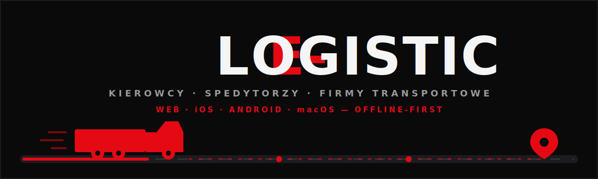
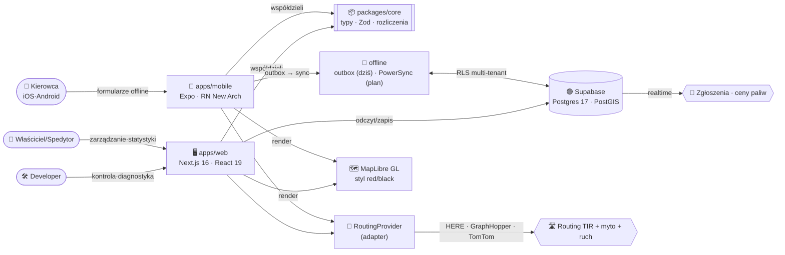

<!-- SYNC: v1.209.0 · #365 · 2026-07-19 — weryfikowane bramką `pnpm docs:check` (CI) -->
<!-- ╔══════════════════════════════════════════════════════════════════╗ -->
<!-- ║                       E - L O G I S T I C                         ║ -->
<!-- ╚══════════════════════════════════════════════════════════════════╝ -->

<div align="center">

<picture>
  <source media="(prefers-color-scheme: dark)" srcset="docs/assets/banner-dark.svg">
  <source media="(prefers-color-scheme: light)" srcset="docs/assets/banner-light.svg">
  
</picture>

<br/><br/>


<br/>

**[ ▶ Demo na żywo » e-logistic-one.vercel.app ](https://e-logistic-one.vercel.app)** &nbsp;·&nbsp; **[ ☁️ Wdrożenie »](DEPLOY.md)** &nbsp;·&nbsp; **[ 🚀 Szybki start »](#-szybki-start)**

<br/>

**[ 🧠 Architektura »](docs/ARCHITECTURE.md)** &nbsp;·&nbsp;
**[ 🗺️ Roadmapa »](docs/ROADMAP.md)** &nbsp;·&nbsp;
**[ 🧱 Model danych »](docs/DATA-MODEL.md)** &nbsp;·&nbsp;
**[ 📐 Analiza/Right-sizing »](docs/ANALIZA.md)** &nbsp;·&nbsp;
**[ 📜 Changelog »](CHANGELOG.md)**

</div>

<br/>

```
━━━━━━━━━━━━━━━━━━━━━━━━━━━━━━━━━━━━━━━━━━━━━━━━━━━━━━━━━━━━━━━━━━━━━━━━━━
```

## ✨ O projekcie

**E‑Logistic** to wieloplatformowy ekosystem dla branży transportowej: aplikacja
dla **kierowców** (telefon/tablet, działa **bez zasięgu**), panel dla **spedytorów**,
dashboard dla **właścicieli firm** oraz **panel developerski** do kontroli całości.

Trzy filary produktu:

1. **Operacje floty** — pojazdy, kierowcy, formularze Paliwo / AdBlue / Trip, pełna
   historia i edycja, działanie offline z synchronizacją po odzyskaniu sieci.
2. **Statystyki i rozliczenia** — spalanie, koszty paliwa po rabatach kart, AdBlue,
   uszkodzenia, stawka za km, **zysk z trasy** liczony automatycznie z formularzy.
3. **Mapa ciężarówkowa** — routing dla TIR-ów (wymiary/waga), myto liczone na odcinki,
   omijanie krajów/promów/płatnych dróg, parkingi/stacje z udogodnieniami, zgłoszenia
   społecznościowe (wypadki, policja, wagi) i ceny paliw budowane z danych kierowców.

> **Right-sized** (patrz [`docs/ANALIZA.md`](docs/ANALIZA.md)): startujemy od wąskiego,
> działającego produktu (flota + formularze + statystyki — **bez drogich API map**),
> a mapę dokładamy warstwami. Część zarobkowa działa od Fazy 1.

<br/>

## 🧩 Moduły

| Moduł | Opis | Status |
|:--|:--|:--:|
| 🚚 **Flota** | Pojazdy (wymiary, zbiorniki, przeglądy, OC, leasing, VIN), kierowcy (PII szyfrowane), zaproszenia (link/QR) |  |
| ⛽ **Formularze** | Paliwo · AdBlue · Trip, offline-first, historia+edycja, podpowiedź ceny z historii |  |
| 🔧 **Usterki** | Zgłaszanie uszkodzeń + graficzny schemat auta (auto‑zaznaczanie), workflow mechanika |  |
| 📊 **Statystyki** | Spalanie (full‑to‑full), koszt po rabatach, AdBlue, podział na pojazdy/tankowania |  |
| 🧾 **Rozliczenia** | Koszt/przychód/zysk/marża per pojazd i okres, eksport CSV + wydruk/PDF |  |
| 📦 **Zlecenia** | Ładunki, przypisanie kierowcy, statusy, **CMR + e‑CMR/POD** (podpis odbiorcy), zdjęcia ładunku, eksport na giełdę |  |
| 🧾 **Faktury** | VAT (numeracja bez luk, status, płatności, bank/IBAN, pozycje, duplikat), eksport Fakturownia + księgowy (VAT/koszty) |  |
| 💰 **Rentowność** | P&L per pojazd i klient, ranking floty, atrybucja kosztów, trendy (6 mies.) |  |
| 🧑‍✈️ **HR kierowcy** | Diety (per diem), czas pracy, wypłaty/zaliczki + PDF rozliczenia, przypomnienia badań (lekarskie/psychotech/ADR) |  |
| 🛠️ **Szkody/OC · Serwis** | Rejestr szkód (status/koszt/ubezpieczyciel), zadania serwisowe wg przebiegu |  |
| 🗂️ **Dokumenty · Kontrahenci** | Sejf dokumentów (Storage, wygasanie), rejestr nabywców/nadawców |  |
| 🗺️ **Mapa TIR** | Routing wg wymiarów/osi + realne myto + ruch (TomTom), POI, ceny paliwa (DE), filtr stacji wg kart, 3D |  |
| 📡 **Społeczność** | Zgłoszenia realtime (wypadki/policja/wagi/korki) na mapie |  |
| 🔔 **Powiadomienia** | W aplikacji (terminy/przeładowanie/usterki) + push (Web Push, VAPID) |  |
| 🔐 **Konta i role** | Owner / Spedytor / Kierowca / Developer · OAuth · passkey · magic link · 2FA (egzekwowane) · RLS · moduły |  |

<br/>

## 🚀 Szybki start

**Wymagania:** Node **≥ 26**, **pnpm 11.5.2** (przypięte w `package.json`, włącz przez `corepack`).
Backend (Supabase) jest opcjonalny do pierwszego uruchomienia UI — pełną konfigurację opisuje [`DEPLOY.md`](DEPLOY.md).

```bash
# 1. Kod (źródło prawdy: GitLab)
git clone https://gitlab.com/Gh0s777tt/e-logistic.git
cd e-logistic

# 2. Zależności (pnpm w wersji przypiętej — przez corepack)
corepack enable
pnpm install

# 3. Zmienne środowiskowe (web)
cp .env.example apps/web/.env.local
#    uzupełnij min. NEXT_PUBLIC_SUPABASE_URL i NEXT_PUBLIC_SUPABASE_ANON_KEY
#    (reszta opcjonalna — mapy, push, faktury; szczegóły w DEPLOY.md)

# 4. Panel web (Next.js) → http://localhost:3000
pnpm dev
```

**Aplikacja mobilna (Expo):**

```bash
cd apps/mobile
pnpm start        # następnie: 'i' = iOS · 'a' = Android · QR = Expo Go
```

**Bramki jakości** (uruchom przed każdym commitem/PR):

```bash
pnpm check        # = biome (lint+format) · tsc · testy · docs:check
```

<br/>

## 🗺️ Architektura (skrót)



<br/>

## 🧱 Stack technologiczny


Menedżer: **pnpm** · monorepo **Turborepo** · lint+format **Biome** (nie ESLint/Prettier).
Szczegóły, wersje i uzasadnienia → [`docs/ARCHITECTURE.md`](docs/ARCHITECTURE.md).

<br/>

## 📁 Struktura repo

```
E-Logistic/
├── apps/
│   ├── web/            # Next.js 16 — dashboard (owner / spedytor / dev)
│   └── mobile/         # Expo SDK 56 — aplikacja kierowcy (iOS / Android)
├── packages/
│   ├── core/           # domena, typy, Zod, silnik rozliczeń (czysty TS)
│   ├── api/            # klient Supabase, warstwa danych, sync
│   ├── ui/             # tokeny motywu red/black (paleta + skale; komponenty w apkach)
│   ├── maps/           # abstrakcja RoutingProvider + adaptery (HERE · GraphHopper · TomTom)
│   └── i18n/           # tłumaczenia — web: PL·EN · mobile: PL·EN·DE·UK (docelowo ×14)
├── supabase/
│   └── migrations/     # SQL: schema + RLS + PostGIS (0001–0080, 82 pliki)
│   # functions/ (Edge Functions/Deno) — PLANOWANE; dziś rolę pełni apps/web/app/api
├── docs/               # ARCHITECTURE · ROADMAP · DATA-MODEL · ANALIZA · SECURITY-RLS
└── .github/workflows/  # nieaktywne (Actions wyłączone) — CI/CD prowadzone na GitLab
```

<br/>

## 🗺️ Roadmapa

Stan dostarczenia jest autorytatywnie śledzony w [`CHANGELOG.md`](CHANGELOG.md); pełny plan → [`docs/ROADMAP.md`](docs/ROADMAP.md).

| Faza | Zakres | Status |
|:--|:--|:--:|
| **0 · Fundament** | monorepo, auth (magic link/passkey/2FA), RLS multi-tenant, motyw red/black | ✅ |
| **1 · Rdzeń właściciela** | flota, formularze offline (outbox), statystyki, rozliczenia, zysk z trasy | ✅ |
| **2 · Mapa podstawowa** | routing TIR + myto na odcinki + POI, geokodowanie, ruch na żywo (TomTom) | ✅ |
| **3 · Społeczność i dane** | zgłoszenia realtime, crowd‑ceny paliw, przypomnienia OC/przeglądów | 🚧 częściowo |
| **4 · Premium nawigacja** | 3D/satelita ✅ · asystent pasa, auto‑reroute, macOS, OCR | ⏳ w toku |

> Ponad pierwotny plan dostarczono m.in.: zlecenia + CMR/POD, faktury VAT (Fakturownia/KSeF), rentowność klientów i pojazdów, diety, czas pracy, wypłaty, szkody/OC, serwis, sejf dokumentów, aplikację mobilną kierowcy z pełnym parytetem zarządzania.

<br/>

## ☁️ Model hostingu

> **Rozwój na GitLab, GitHub jako mirror.**

| Rola | Repozytorium | Przeznaczenie |
|:--|:--|:--|
| 🦊 **Źródło prawdy** | [`gitlab.com/Gh0s777tt/e-logistic`](https://gitlab.com/Gh0s777tt/e-logistic) | Wszystkie pushe i **całe CI/CD**; chroniona gałąź `main`. |
| 🐙 **Mirror (publiczny)** | [`github.com/Gh0s777tt/E-Map`](https://github.com/Gh0s777tt/E-Map) | Widoczność/discovery; GitHub **Actions wyłączone**. |

To README ma jedno źródło (GitLab) i jest propagowane na mirror. Badge statusu CI (pipeline GitLab)
oraz pokrycia testami zostaną dopięte wraz z pipeline’em w ramach automatyzacji CI/CD.

<br/>

## 📚 Dokumentacja

| Dokument | Zawartość |
|:--|:--|
| [`docs/ARCHITECTURE.md`](docs/ARCHITECTURE.md) | Stack, granice pakietów, decyzje projektowe |
| [`docs/DATA-MODEL.md`](docs/DATA-MODEL.md) | Schemat bazy, migracje, PostGIS |
| [`docs/SECURITY-RLS.md`](docs/SECURITY-RLS.md) | Model bezpieczeństwa, polityki RLS, multi‑tenant |
| [`docs/ROADMAP.md`](docs/ROADMAP.md) | Fazy i stan dostarczenia |
| [`docs/ANALIZA.md`](docs/ANALIZA.md) | Right‑sizing, uzasadnienie zakresu |
| [`DEPLOY.md`](DEPLOY.md) | Wdrożenie web (Vercel) + mobile (EAS) + zmienne środowiskowe |
| [`CHANGELOG.md`](CHANGELOG.md) | Historia zmian (Keep a Changelog + `[#NNN]`) |

<br/>

---

<div align="center">

**E‑Logistic** &nbsp;·&nbsp; oprogramowanie własnościowe (UNLICENSED) &nbsp;·&nbsp; motyw `#E50914` na `#0a0a0a`

</div>
