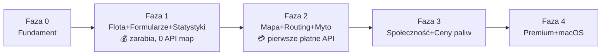

# 📐 Analiza i right-sizing — E‑Logistic

> Status: **propozycja do akceptacji** · wersja 0.1.0 · 2026-06-20
> Cel dokumentu: szczerze oddzielić „co da się zrobić tanio i szybko" od „co kosztuje i wymaga decyzji".

---

## 1. Skala wizji vs rzeczywistość

Pełna wizja (mapa TIR z mytem, omijaniem krajów, POI, satelitą, asystentem pasa, zgłoszeniami
na żywo, cenami paliw, kartami) to zakres **konkurentów typu PTV / Sygic Truck / Trimble Maps**
— produktów rozwijanych latami przez duże zespoły. To **nie** powód, by rezygnować — to powód,
by **ułożyć kolejność** tak, żeby produkt zarabiał, zanim wydamy złotówkę na drogie API.

Twoja własna filozofia z E-Bot: *„wąski, działający produkt zamiast 75 modułów"*. Stosujemy ją tutaj.

---

## 2. Co budujemy SAMI (tanio, nasze dane = przewaga)

| Funkcja | Jak | Koszt |
|:--|:--|:--|
| Flota, kierowcy, formularze | Supabase + PowerSync | hosting (niski) |
| Statystyki i rozliczenia | `packages/core`, czyste funkcje | zero |
| Zgłoszenia realtime (Yanosik-style) | Supabase Realtime + PostGIS | hosting |
| **Ceny paliw** | agregacja z Formularza Paliwowego | zero (rośnie z użyciem) |
| Oceny/udogodnienia parkingów | oceny kierowców | zero |
| POI bazowe | OSM + Truck Parking Europe (open data) | zero (ingest) |

> **Kluczowa synergia:** formularze, które i tak wypełnia kierowca, **same budują** bazę cen paliw
> i ocen parkingów. Nie kupujemy tych danych — generujemy je jako efekt uboczny codziennej pracy.

---

## 3. Co KOSZTUJE (decyzje budżetowe)

| Element | Dostawca | Charakter kosztu |
|:--|:--|:--|
| Routing TIR + **myto** | HERE / GraphHopper (start), PTV (premium) | per zapytanie / abonament B2B |
| Tile render (jeśli nie self-host) | MapTiler / podobny | per zapytanie / MAU |
| Geokodowanie | HERE / MapTiler / Nominatim | per zapytanie (Nominatim self-host = tanio) |
| SMS / WhatsApp (zaproszenia) | Twilio / MessageBird | per wiadomość |
| Satelita / 3D / asystent pasa | Navigation SDK / 3D tiles | abonament (Faza 4) |
| OCR paragonów | usługa OCR / model | per dokument (Faza 4) |

**Wybrana strategia (Twoja decyzja): hybryda.**
- Render: **MapLibre** (własny styl, brak lock-inu na wygląd).
- Routing+myto: **HERE** na start (dobry truck+toll, przyzwoity free tier) z adapterem,
  **GraphHopper** jako tańsza alternatywa, **self-host Valhalla** gdy skala uzasadni koszt.
- Płatne API włączamy dopiero w Fazie 2 — Faza 1 (zarobkowa) ich nie potrzebuje.

---

## 4. Dlaczego ta kolejność

- **Faza 1 dowozi wartość bez ryzyka kosztowego** — można ją sprzedawać i testować na realnych firmach.
- Mapę (najdroższą część) włączamy, gdy produkt ma już użytkowników i dane (które ją wzbogacą).
- Każda faza jest samodzielnie użyteczna — brak „wielkiego wybuchu".

---

## 5. Ryzyka i jak je tniemy

| Ryzyko | Mitigacja |
|:--|:--|
| Koszt API map rośnie ze skalą | abstrakcja `RoutingProvider` → zmiana dostawcy/self-host bez przepisywania apki |
| Dokładność myta | start HERE/GraphHopper; PTV tylko jeśli klienci wymagają „co do grosza" |
| Konflikty synchronizacji offline | formularze niemutowalne + rewizje + UUIDv7 + last-write-wins per pole |
| Wrażliwość PIN-ów kart | szyfrowanie + RLS owner-only + audyt; rozważyć brak PIN-u w apce kierowcy |
| Zakres i18n ×14 od startu | start PL+EN, parytet w CI, reszta dokładana |
| „Najnowocześniejszy stack" = niestabilność | świeże frameworki, ale konserwatyzm w sync/security/rozliczeniach |

---

## 6. Rekomendacja końcowa

Akceptuj zakres **Faz 0–1 jako pierwszy realny cel**. To daje:
- działający produkt (flota + formularze offline + statystyki/zysk),
- zero zależności od płatnych API,
- fundament (monorepo, auth, RLS, CI) pod wszystko, co dalej.

Mapę projektujemy już teraz (abstrakcja gotowa), ale **włączamy ją w Fazie 2** — gdy jest na czym budować.
