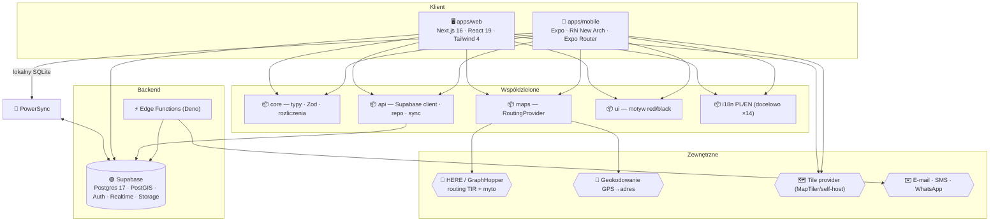
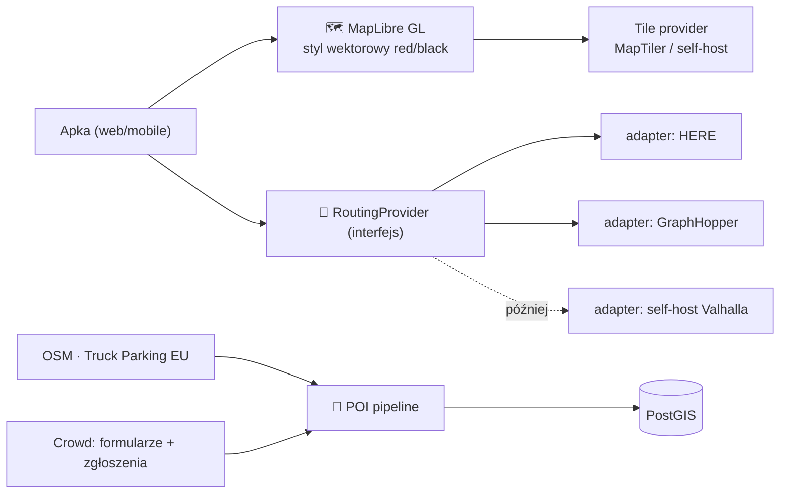

# 🧠 Architektura — E‑Logistic

> Status: **w realizacji** · stan na v1.200.0 (#355) · 2026-07-14
> Decyzje wstępne: dokumentacja przed kodem · mapa = hybryda MapLibre+HERE/GraphHopper · web+mobile równolegle.
>
> **Stan implementacji** (ten dokument opisuje architekturę **docelową**):
> - ✅ **Platforma:** Next.js 16 + React 19 + Tailwind 4 (web) · Supabase (Postgres 17 + PostGIS + Auth + RLS + Vault) · MapLibre + `RoutingProvider` (HERE/GraphHopper) · offline przez **outbox** (localStorage) · web‑push · 2FA TOTP + passkeys · szyfrowanie PII/PIN · generowane typy DB · rate‑limiting · **bramka RLS w CI** ([`audit:rls`](../scripts/audit-rls.mjs)).
> - ✅ **Moduły biznesowe (v1.0–1.50):** flota (pojazdy/kierowcy/karty) · formularze offline (paliwo/AdBlue/trip) + historia · mapa TIR + POI + ceny paliw + 3D · statystyki (spalanie/anomalie/koszty/CO₂) · **zlecenia** (przypisania, statusy, CMR, **e‑CMR/POD**, zdjęcia ładunku) · **faktury** (numeracja bez luk, status, płatność, bank/IBAN, pozycje, duplikat, eksport Fakturownia + księgowy VAT/koszty) · **sejf dokumentów** · rozliczenia + zestawienie miesięczne · **rentowność klientów i pojazdów** (P&L, snapshot + trend + CSV) · **alerty progowe** · **diety** · **czas pracy** · **wypłaty kierowcy** · **szkody/OC** · przypomnienia badań (psychotech) · **kontrahenci** · koszty pojazdu · zapisane miejsca · powiadomienia (in‑app + push web/Expo) · **aplikacja mobilna kierowcy** (auth/formularze/zlecenia/zdjęcia/POD/push) · **dwujęzyczność PL/EN** całego UI widokowego.
> - 🔜 **Planowane / rozważane (jeszcze nie w kodzie):** **PowerSync** (offline SQLite ↔ Supabase — dziś rolę pełni outbox), **Supabase Edge Functions** (dziś rolę pełnią trasy `/api` Next.js/Vercel), **shadcn/ui**, **TanStack Query**, **Zustand**, **Sentry**, **mapa w aplikacji mobilnej** (faza M3 — auth/formularze/zlecenia/push już są), profil **truck** w routingu (płatny tier GraphHopper), kolejne języki i18n (dziś PL/EN; docelowo ×14).

---

## 1. Cele architektoniczne

| Cel | Konsekwencja projektowa |
|:--|:--|
| **Offline-first** (kierowca bez zasięgu) | lokalny SQLite + kolejka sync (PowerSync), zapis natychmiastowy, sync po sieci |
| **Web + mobile równolegle** | monorepo, współdzielony `packages/core` (logika+typy) zasila obie apki |
| **Spójność danych „na bieżąco"** | jedno źródło prawdy (Supabase/Postgres), SemVer+changelog, migracje wersjonowane |
| **Niezależność od vendora map** | render (MapLibre) odseparowany od routingu; routing za abstrakcją `RoutingProvider` |
| **Multi-tenant + role** | RLS w Postgres; Owner/Spedytor/Kierowca/Developer |
| **Najnowocześniejszy, ale stabilny rdzeń** | świeże wersje frameworków; konserwatyzm w sync/security/rozliczeniach |

---

## 2. Monorepo

**Turborepo + pnpm workspaces.** Jedno repo = brak rozjazdów między web a mobile (Twój wymóg synchronizacji).

```
apps/
  web/      → Next.js 16 (App Router, RSC, Server Actions) — dashboard
  mobile/   → Expo + React Native (New Architecture) — apka kierowcy
packages/
  core/     → domena: typy, schematy Zod, silnik rozliczeń (czysty TS, 0 zależności UI)
  api/      → klient Supabase, repozytoria danych, warstwa sync (outbox)
  ui/       → tokeny motywu (red/black): paleta + skale (komponenty żyją w apkach)
  maps/     → RoutingProvider (interfejs) + adaptery HERE/GraphHopper + typy geo
  i18n/     → tłumaczenia PL/EN (docelowo ×14) + helpery, parytet kluczy w teście
supabase/
  migrations/  → SQL (schema, RLS, PostGIS, indeksy) — 51 migracji (0001–0051)
  # functions/ (Edge Functions/Deno) — PLANOWANE; dziś rolę pełnią trasy /api (Next.js/Vercel)
# Konfiguracja współdzielona w katalogu głównym: tsconfig.base.json · biome.json · turbo.json
```

**Zasada:** logika biznesowa (rozliczenia, walidacja, konwersje) żyje wyłącznie w `packages/core`
i jest testowana jednostkowo. Apki to „cienkie" warstwy prezentacji.

---

## 3. Warstwy aplikacji



---

## 4. Offline-first i synchronizacja

**Najtrudniejszy element. Wybór: PowerSync (lokalny SQLite ↔ Supabase).**

- Każdy formularz zapisuje się **najpierw lokalnie** → kierowca pracuje bez sieci.
- **Outbox/sync rules**: PowerSync wgrywa zmiany po odzyskaniu połączenia; pobiera tylko
  podzbiór danych dla danej firmy/kierowcy (mniej danych na telefonie, RLS po stronie serwera).
- **Idempotencja i konflikty:**
  - klucze rekordów = **UUIDv7** generowane na kliencie (sortowalne czasowo),
  - kolumny `created_at`, `updated_at`, `synced_at`, `device_id`, `revision`,
  - formularze są **append-mostly**: wysłany formularz jest niemutowalny; „edycja" tworzy
    nową rewizję w `*_revisions` (spełnia wymóg **historii edycji** i audytu).
- **Konflikt edycji**: ostatni zapis wygrywa per-pole + zachowana pełna historia rewizji.
- Stany w UI: `szkic → w kolejce → zsynchronizowany → błąd (retry)`.

Alternatywy rozważane: WatermelonDB, RxDB. PowerSync wybrany za natywne wsparcie Supabase
i reguły synchronizacji per-tenant.

---

## 5. Warstwa map (hybryda)

Render **odseparowany** od routingu — kluczowe dla niezależności i kosztów.



- **Render:** MapLibre GL JS (web) + MapLibre Native (mobile), własny styl wektorowy red/black,
  tryb dzień/noc = dwa warianty stylu.
- **Routing TIR + myto:** interfejs `RoutingProvider` z metodami `route()`, `tollCost()`,
  `geocode()`, `reverseGeocode()`. Adaptery: **HERE** (start, dobry truck+toll+free tier) i
  **GraphHopper** (alternatywa/tańsza). Zmiana dostawcy = zmiana adaptera, nie apki.
- **Parametry pojazdu** (wysokość/szerokość/długość/waga/typ, omijanie krajów/myta/promów/dróg
  gruntowych) mapowane na profil providera.
- **POI** (parkingi, stacje, promy, lotniska, firmy): pipeline ingest **OSM + Truck Parking
  Europe** → PostGIS, wzbogacany danymi crowd. Udogodnienia, oceny, akceptacja kart/SNAP/Travis.
- **Wyliczanie kosztu trasy z podziałem na odcinki**: z odpowiedzi toll API + własne stawki.
- **Satelita/3D, asystent pasa**: Faza 4 (Navigation SDK / tiles 3D).

> Szczegółowe porównanie kosztów dostawców → [`ANALIZA.md`](ANALIZA.md).

---

## 6. Dane społecznościowe (budowane samodzielnie)

Tego nie kupujemy — to przewaga produktu (dane są nasze):

- **Zgłoszenia realtime** (wypadek/policja/waga/korek/zamknięcie): tabela + PostGIS +
  **Supabase Realtime** (broadcast do kierowców w pobliżu), wygasanie i zanik pewności w czasie,
  głosy potwierdzające.
- **Ceny paliw**: agregowane z **Formularza Paliwowego** kierowców → własna, rosnąca baza.
  Seed: OSM `amenity=fuel` (+ otwarte feedy tam, gdzie istnieją).
- **Oceny/udogodnienia parkingów**: z ocen kierowców (bez zależności od ocen Google).

---

## 7. Uwierzytelnianie i role

**Supabase Auth** pokrywa większość wymagań natywnie:

| Wymóg | Realizacja |
|:--|:--|
| E-mail + hasło | ✅ natywnie |
| Google / Apple / Microsoft(Azure) | ✅ OAuth |
| Passkey (WebAuthn) | ✅ |
| Logowanie/rejestracja bez hasła | ✅ magic link / OTP |
| 2FA | ✅ TOTP (MFA) |
| **Samsung Account** | ⚠️ niszowe — oznaczone jako „później/opcjonalne" (Apple+Google pokrywają telefony) |

- **Role**: `developer`, `owner`, `dispatcher` (spedytor), `driver` — w tabeli `memberships` per firma.
- **Zaproszenie kierowcy**: właściciel generuje **podpisany token** → link + **QR** (deep link / universal links),
  wysyłka e-mail (Supabase) / SMS (Twilio/MessageBird) / WhatsApp (Business API lub `wa.me`).
  Token przy rejestracji od razu przypisuje kierowcę do firmy i pojazdu.

---

## 8. Bezpieczeństwo

- **RLS** na wszystkich tabelach multi-tenant: kierowca widzi tylko swoje formularze; spedytor/owner
  tylko swoją firmę; developer ma wgląd diagnostyczny (audytowany).
- **PIN-y kart paliwowych / dane wrażliwe**: szyfrowane (Supabase Vault / pgcrypto). **Ustawia** `owner`;
  **odczyt** dla aktywnych członków firmy — kierowca musi znać PIN, by zapłacić w automacie na stacji.
  Każdy odczyt zapisywany w **audit_log**.
- Sekrety w env (`.env.example` szablon), skan `gitleaks` + `codeql` w CI.
- Storage (dokumenty, zdjęcia paragonów): polityki dostępu per firma.

---

## 9. Stan, walidacja, i18n

- **Walidacja**: Zod w `packages/core` — te same schematy w formularzach web i mobile oraz w Edge Functions.
- **Stan serwera**: TanStack Query; **stan klienta**: Zustand; lokalna baza PowerSync jest reaktywna. *(🔜 — dziś React hooks + outbox.)*
- **i18n**: dziś **PL/EN** (docelowo ×14 jak w ekosystemie); język czytany serwerowo z ciasteczka (RSC, bez migotania) + kliencki `LocaleProvider`/`useT`; **parytet kluczy** wymuszony typem `Record<MessageKey>` i testem.

---

## 10. CI/CD i obserwowalność

- **GitHub Actions**: `ci.yml` (biome, tsc, testy, build web, typecheck mobile), `codeql.yml`, Dependabot.
- **Web**: Vercel. **Mobile**: EAS Build + EAS Update (OTA). **Migracje**: Supabase CLI w pipeline.
- **Sentry** (web+mobile), logi Edge Functions.
- **Wydania**: tag `vX.Y.Z` + GitHub Release generowany z `CHANGELOG.md`.

---

## 11. Pojazdy i platformy docelowe

| Platforma | Technologia | Priorytet |
|:--|:--|:--|
| Web (dashboard) | Next.js 16 | Faza 1 (równolegle) |
| iOS / Android (kierowca) | Expo | Faza 1 (równolegle) |
| macOS | PWA / Tauri 2 (shell weba) | Faza 4 / wg popytu |

---

## 12. Decyzje otwarte (do potwierdzenia)

1. Nazwa repo: zostawić `E-Map` czy zmienić na `E-Logistic`? *(otwarte — repo nadal `E-Map`)*
2. Tile provider do renderu: **MapTiler** (szybki start) vs self-host tiles (taniej przy skali)? *(otwarte)*
3. Dostawca SMS/WhatsApp: Twilio vs MessageBird vs inny? *(otwarte)*
4. ~~Czy PIN kart ma być dostępny w apce kierowcy~~ → **rozstrzygnięte:** ustawia owner, **odczyt dla aktywnych członków firmy** (kierowca płaci w automacie), każdy odczyt audytowany.
5. ~~Zakres i18n od startu~~ → **rozstrzygnięte:** start **PL+EN**, kolejne języki dokładane z zachowaniem parytetu.
