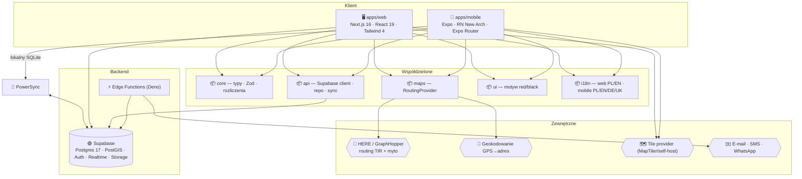
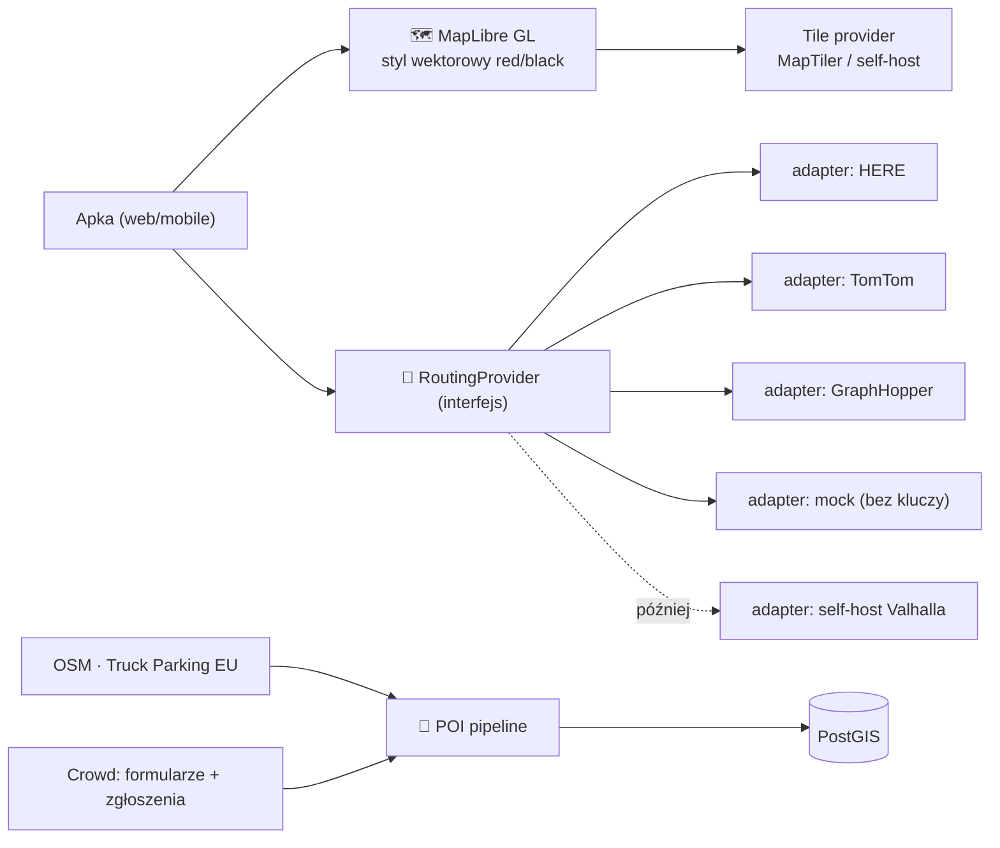

# 🧠 Architektura — E‑Logistic

> Status: **w realizacji** · stan na v1.247.0 (#415) · 2026-08-19
> Decyzje wstępne: dokumentacja przed kodem · mapa = hybryda MapLibre+HERE/GraphHopper · web+mobile równolegle.
>
> **Stan implementacji** (ten dokument opisuje architekturę **docelową**):
> - ✅ **Platforma:** Next.js 16 + React 19 + Tailwind 4 (web) · Supabase (Postgres 17 + PostGIS + Auth + RLS + Vault) · MapLibre + `RoutingProvider` (HERE/GraphHopper) · offline przez **outbox** (localStorage) · web‑push · 2FA TOTP + passkeys · szyfrowanie PII/PIN · generowane typy DB · rate‑limiting · **bramka RLS w CI** (job `rls` w [`.gitlab-ci.yml`](../.gitlab-ci.yml) uruchamia [`audit:rls`](../scripts/audit-rls.mjs); aktywny po ustawieniu zmiennej CI `SUPABASE_DB_URL`, patrz [SECURITY‑RLS.md](SECURITY-RLS.md)).
> - ✅ **Moduły biznesowe (v1.0–1.50):** flota (pojazdy/kierowcy/karty) · formularze offline (paliwo/AdBlue/trip) + historia · mapa TIR + POI + ceny paliw + 3D · statystyki (spalanie/anomalie/koszty/CO₂) · **zlecenia** (przypisania, statusy, CMR, **e‑CMR/POD**, zdjęcia ładunku) · **faktury** (numeracja bez luk, status, płatność, bank/IBAN, pozycje, duplikat, eksport Fakturownia + księgowy VAT/koszty) · **sejf dokumentów** · rozliczenia + zestawienie miesięczne · **rentowność klientów i pojazdów** (P&L, snapshot + trend + CSV) · **alerty progowe** · **diety** · **czas pracy** · **wypłaty kierowcy** · **szkody/OC** · przypomnienia badań (psychotech) · **kontrahenci** · koszty pojazdu · zapisane miejsca · powiadomienia (in‑app + push web/Expo) · **aplikacja mobilna kierowcy** (auth/formularze/zlecenia/zdjęcia/POD/push) · **dwujęzyczność PL/EN** całego UI widokowego.
> - ✅ **Doszło po v1.202.0:** adapter **TomTom** (routing, ruch, wyszukiwanie POI) obok HERE i GraphHoppera · **mapa w aplikacji mobilnej** (`apps/mobile/app/map.tsx`) · profil **truck** w routingu z gabarytami i osiami z kartoteki, kategorią tunelową ADR i klasą emisji · **uwagi dostawcy** (`RouteNotice`) niesione razem z trasą · statystyki pieniężne przeliczane po kursach ECB zamiast filtrowane do EUR · **zwrot VAT za paliwo** per kraj · **koszty operacyjne** w rachunku wyjazdu · i18n mobile w **czterech** językach (PL/EN/DE/UK; web nadal PL/EN).
> - ✅ **Docelowy stack wpięty falami (#306 · #310 · #311):** **Sentry** — web ([`instrumentation.ts`](../apps/web/instrumentation.ts), [`instrumentation-client.ts`](../apps/web/instrumentation-client.ts), [`global-error.tsx`](../apps/web/app/global-error.tsx), crony, degradacja rate‑limitu) i mobile ([`_layout.tsx`](../apps/mobile/app/_layout.tsx), `ErrorBoundary`), bez DSN no‑op · **TanStack Query** — [`QueryProvider`](../apps/web/components/QueryProvider.tsx) nad całym panelem `(app)`, ekrany przepinane falami · **PowerSync** — [`apps/mobile/lib/powersync.ts`](../apps/mobile/lib/powersync.ts), fala 1 = **sama infrastruktura + kafelek statusu** w [`settings.tsx`](../apps/mobile/app/settings.tsx) (natywny moduł ładowany leniwie; bez `EXPO_PUBLIC_POWERSYNC_URL` no‑op); żaden ekran list nie czyta jeszcze z lokalnego SQLite, zapisy dalej przez outbox.
> - 🔜 **Planowane / rozważane (jeszcze nie w kodzie):** **PowerSync fala 2** (zapisy z lokalnego SQLite zamiast outboxu), **TanStack Query na pozostałych ekranach**, **Supabase Edge Functions** (dziś rolę pełnią trasy `/api` Next.js/Vercel), **shadcn/ui**, **Zustand**, **strefy niskiej emisji (LEZ)** i **weekendowe zakazy ruchu** (blokada nie techniczna, tylko źródło danych — żaden zintegrowany dostawca ich nie oddaje), **HUD/asystent pasa**, kolejne języki i18n (docelowo ×14).

---

## 1. Cele architektoniczne

| Cel | Konsekwencja projektowa |
|:--|:--|
| **Offline-first** (kierowca bez zasięgu) | lokalny SQLite + kolejka sync (PowerSync), zapis natychmiastowy, sync po sieci |
| **Web + mobile równolegle** | monorepo, współdzielony `packages/core` (logika+typy) zasila obie apki |
| **Spójność danych „na bieżąco"** | jedno źródło prawdy (Supabase/Postgres), SemVer+changelog, migracje wersjonowane |
| **Niezależność od vendora map** | render (MapLibre) odseparowany od routingu; routing za abstrakcją `RoutingProvider` |
| **Multi-tenant + role** | RLS w Postgres; Owner/Spedytor/Kierowca/Developer |
| **Najnowocześniejszy, ale stabilny rdzeń** | świeże wersje frameworków; konserwatyzm w sync/security/rozliczeniach |

---

## 2. Monorepo

**Turborepo + pnpm workspaces.** Jedno repo = brak rozjazdów między web a mobile (Twój wymóg synchronizacji).

```
apps/
  web/      → Next.js 16 (App Router, RSC, Server Actions) — dashboard
  mobile/   → Expo + React Native (New Architecture) — apka kierowcy
packages/
  core/     → domena: typy, schematy Zod, silnik rozliczeń **i outbox** (`outbox.ts`) — czysty TS, 0 zależności UI
  api/      → klient Supabase, repozytoria danych (adaptery magazynu outboxu żyją w apkach)
  ui/       → tokeny motywu (red/black): paleta + skale (komponenty żyją w apkach)
  maps/     → RoutingProvider (interfejs) + adaptery HERE/TomTom/GraphHopper/mock + typy geo
  i18n/     → tłumaczenia: web PL/EN, mobile PL/EN/DE/UK (docelowo ×14) + helpery, parytet kluczy w teście
supabase/
  migrations/  → SQL (schema, RLS, PostGIS, indeksy) — 112 plików (0001–0110; 0017/0018 zdublowane historycznie)
  # functions/ (Edge Functions/Deno) — PLANOWANE; dziś rolę pełnią trasy /api (Next.js/Vercel)
# Konfiguracja współdzielona w katalogu głównym: tsconfig.base.json · biome.json · turbo.json
```

**Zasada:** logika biznesowa (rozliczenia, walidacja, konwersje) żyje wyłącznie w `packages/core`
i jest testowana jednostkowo. Apki to „cienkie" warstwy prezentacji.

---

## 3. Warstwy aplikacji


```mermaid
flowchart TB
  subgraph Klient
    WEB["🖥️ apps/web<br/>Next.js 16 · React 19 · Tailwind 4"]
    MOB["📱 apps/mobile<br/>Expo · RN New Arch · Expo Router"]
  end
  subgraph Współdzielone
    CORE["📦 core — typy · Zod · rozliczenia"]
    API["📦 api — Supabase client · repo · sync"]
    MAPS["📦 maps — RoutingProvider"]
    UI["📦 ui — motyw red/black"]
    I18N["📦 i18n — web PL/EN · mobile PL/EN/DE/UK"]
  end
  subgraph Backend
    SB[("🟢 Supabase<br/>Postgres 17 · PostGIS · Auth · Realtime · Storage")]
    EDGE["⚡ Edge Functions (Deno)"]
  end
  subgraph Zewnętrzne
    ROUTE{{"🧭 HERE / GraphHopper<br/>routing TIR + myto"}}
    GEO{{"📍 Geokodowanie GPS→adres"}}
    TILES{{"🗺️ Tile provider (MapTiler/self-host)"}}
    MSG{{"✉️ E-mail · SMS · WhatsApp"}}
  end

  WEB --> CORE & API & MAPS & UI & I18N
  MOB --> CORE & API & MAPS & UI & I18N
  MOB -->|lokalny SQLite| PS["🔁 PowerSync"]
  PS <--> SB
  WEB --> SB
  API --> SB
  EDGE --> SB
  MAPS --> ROUTE
  MAPS --> GEO
  WEB & MOB --> TILES
  EDGE --> MSG
```

---

## 4. Offline-first i synchronizacja

**Najtrudniejszy element. Wybór: PowerSync (lokalny SQLite ↔ Supabase).**

> **Stan (fala 1, #311):** PowerSync jest w mobile, ale wyłącznie jako **infrastruktura + status**:
> [`lib/powersync.ts`](../apps/mobile/lib/powersync.ts) potrafi się połączyć i zsynchronizować,
> a jedynym konsumentem lokalnej bazy jest kafelek w Ustawieniach (`connected` / `lastSyncedAt` /
> `select count(*)`). **Żaden ekran list nie jest jeszcze hydrowany z SQLite** — nie ma ani jednego
> `.watch()`, a orders/fuel/adblue/expenses czytają dalej z sieci. Zapisy przechodzą outboxem,
> `uploadData` celowo kwituje kolejkę CRUD bez wysyłki. Fala 2 (przepięcie zapisów) zaczyna się
> więc od zbudowania ścieżki ODCZYTU i skonfrontowania schematu z `buildDb()` z realnym renderem —
> to nie jest zrobione. Opis niżej dotyczy stanu **docelowego**.

- Każdy formularz zapisuje się **najpierw lokalnie** → kierowca pracuje bez sieci.
- **Outbox/sync rules**: PowerSync wgrywa zmiany po odzyskaniu połączenia; pobiera tylko
  podzbiór danych dla danej firmy/kierowcy (mniej danych na telefonie, RLS po stronie serwera).
- **Idempotencja i konflikty:**
  - klucze rekordów = **UUIDv7** generowane na kliencie (sortowalne czasowo),
  - kolumny `created_at`, `updated_at`, `synced_at`, `device_id`, `revision`,
  - formularze są **append-mostly**: wysłany formularz jest niemutowalny; „edycja" tworzy
    nową rewizję w `*_revisions` (spełnia wymóg **historii edycji** i audytu).
- **Konflikt edycji**: ostatni zapis wygrywa per-pole + zachowana pełna historia rewizji.
- Stany w UI: `szkic → w kolejce → zsynchronizowany → błąd (retry)`.

Alternatywy rozważane: WatermelonDB, RxDB. PowerSync wybrany za natywne wsparcie Supabase
i reguły synchronizacji per-tenant.

---

## 5. Warstwa map (hybryda)

Render **odseparowany** od routingu — kluczowe dla niezależności i kosztów.


```mermaid
flowchart LR
  APP["Apka (web/mobile)"] --> RENDER["🗺️ MapLibre GL<br/>styl wektorowy red/black"]
  APP --> RP["🧭 RoutingProvider (interfejs)"]
  RP --> HERE["adapter: HERE"]
  RP --> TT["adapter: TomTom"]
  RP --> GH["adapter: GraphHopper"]
  RP --> MOCK["adapter: mock (bez kluczy)"]
  RP -.->|później| VALHALLA["adapter: self-host Valhalla"]
  RENDER --> TILES["Tile provider<br/>MapTiler / self-host"]
  POI["📍 POI pipeline"] --> PG[("PostGIS")]
  OSM["OSM · Truck Parking EU"] --> POI
  CROWD["Crowd: formularze + zgłoszenia"] --> POI
```

- **Render:** MapLibre GL JS (web) + MapLibre Native (mobile). Podkład jest **cudzy i wybierany
  wg dostępnych kluczy** ([`mapTheme.ts`](../apps/web/app/(app)/map/mapTheme.ts),
  [`mapStyle.ts`](../apps/mobile/lib/mapStyle.ts)): TomTom „night" (raster) → MapTiler
  (`streets-v2-dark`, `hybrid`, `terrain`) → raster OSM przyciemniony. Motyw red/black niosą
  **własne warstwy** (trasa, POI, zgłoszenia, ruch), nie własny styl podkładu — dlatego mapa jest
  zawsze ciemna, bez wariantu dziennego, a etykiety podkładu zostają w języku dostawcy (decyzja 7).
- **Routing TIR + myto:** interfejs `RoutingProvider` z metodami `route()`, `tollCost()`,
  `geocode()`, `reverseGeocode()`. Adaptery w kolejności wyboru: **HERE** → **TomTom** →
  **GraphHopper** → **mock**. Zmiana dostawcy = zmiana adaptera, nie apki; mock trzyma
  ten sam kontrakt, więc apka uruchamia się bez żadnego klucza.
- **Parametry pojazdu** (wysokość/szerokość/długość/waga/typ, liczba osi, **kategoria
  tunelowa ADR**, klasa emisji, omijanie krajów/myta/promów/dróg gruntowych) mapowane na
  profil providera — **czytane z kartoteki pojazdu**, nie ze stałych w ekranie.
  Brak wartości zostaje brakiem: pusty gabaryt jest widoczny na ekranie planowania, bo
  parametr podstawiony „na oko" wygląda tak samo jak prawdziwy i tak samo trafia do trasy.
- **Uwagi dostawcy** (`RouteNotice`) wracają razem z trasą i są **wymaganym** polem wyniku.
  Dostawca informuje w nich m.in. o zignorowanym ograniczeniu; przy zejściu z profilu
  truck na samochodowy adapter dokłada uwagę o wadze `critical`, żeby zejście nie było ciche.
- **POI** (parkingi, stacje, promy, lotniska, firmy): pipeline ingest **OSM + Truck Parking
  Europe** → PostGIS, wzbogacany danymi crowd. Udogodnienia, oceny, akceptacja kart/SNAP/Travis.
- **Wyliczanie kosztu trasy z podziałem na odcinki**: z odpowiedzi toll API + własne stawki.
- **Satelita i 3D**: ✅ w webie — podkład `hybrid` (MapTiler) oraz teren `raster-dem` z bryłami
  budynków. **Asystent pasa / HUD**: Faza 4 (Navigation SDK).

> Szczegółowe porównanie kosztów dostawców → [`ANALIZA.md`](ANALIZA.md).

---

## 6. Dane społecznościowe (budowane samodzielnie)

Tego nie kupujemy — to przewaga produktu (dane są nasze):

- **Zgłoszenia realtime** (wypadek/policja/waga/korek/zamknięcie): tabela + PostGIS +
  **Supabase Realtime** (broadcast do kierowców w pobliżu), wygasanie i zanik pewności w czasie,
  głosy potwierdzające.
- **Ceny paliw**: agregowane z **Formularza Paliwowego** kierowców → własna, rosnąca baza.
  Seed: OSM `amenity=fuel` (+ otwarte feedy tam, gdzie istnieją).
- **Oceny/udogodnienia parkingów**: z ocen kierowców (bez zależności od ocen Google).

---

## 7. Uwierzytelnianie i role

**Supabase Auth** pokrywa większość wymagań natywnie:

| Wymóg | Realizacja |
|:--|:--|
| E-mail + hasło | ✅ natywnie |
| Google / Apple / Microsoft(Azure) | ✅ OAuth |
| Passkey (WebAuthn) | ✅ |
| Logowanie/rejestracja bez hasła | ✅ magic link / OTP |
| 2FA | ✅ TOTP (MFA) |
| **Samsung Account** | ⚠️ niszowe — oznaczone jako „później/opcjonalne" (Apple+Google pokrywają telefony) |

- **Role**: `developer`, `owner`, `dispatcher` (spedytor), `driver` — w tabeli `memberships` per firma.
- **Zaproszenie kierowcy**: ✅ właściciel/spedytor generuje **podpisany token** → link `/join?token=…`
  + **QR** do skopiowania i przekazania własnym kanałem. Token przy rejestracji od razu przypisuje
  kierowcę do firmy i pojazdu. 🔜 automatyczna wysyłka (e-mail / SMS / WhatsApp) — w repo nie ma
  jeszcze żadnego kanału dostarczania, a dostawca SMS/WhatsApp to decyzja otwarta (12.3).

---

## 8. Bezpieczeństwo

- **RLS** na wszystkich tabelach multi-tenant: kierowca widzi tylko swoje formularze; spedytor/owner
  tylko swoją firmę; developer ma wgląd diagnostyczny (audytowany).
- **PIN-y kart paliwowych / dane wrażliwe**: szyfrowane (Supabase Vault / pgcrypto). **Ustawia** `owner`;
  **odczyt** dla aktywnych członków firmy — kierowca musi znać PIN, by zapłacić w automacie na stacji.
  Każdy odczyt zapisywany w **audit_log**.
- Sekrety w env (`.env.example` szablon); w CI skan `gitleaks` (pełna historia) + **GitLab SAST/Semgrep** (`semgrep-sast` z szablonu `Security/SAST.gitlab-ci.yml`). CodeQL **nie jest używany** — to narzędzie GitHuba, a pipeline stoi na GitLabie.
- Storage (dokumenty, zdjęcia paragonów): polityki dostępu per firma.

---

## 9. Stan, walidacja, i18n

- **Walidacja**: Zod w `packages/core` — te same schematy w formularzach web i mobile oraz w trasach
  `/api` (Next.js); Edge Functions dopiero planowane, więc dziś nie ma tam czego współdzielić.
- **Stan serwera**: ✅ TanStack Query — `QueryProvider` nad panelem `(app)`; ekrany przepinane falami, więc część list nadal czyta dane własnym hookiem. **Stan klienta**: 🔜 Zustand *(dziś React hooks)*. Lokalna baza PowerSync jest reaktywna, ale dziś nie zasila żadnego ekranu — jedynym jej konsumentem jest kafelek statusu w Ustawieniach mobile.
- **i18n**: panel web **PL/EN** ([`LOCALES`](../packages/i18n/src/index.ts)), aplikacja kierowcy
  **PL/EN/DE/UK** ([`MOBILE_LOCALES`](../packages/i18n/src/mobile.ts)); docelowo ×14 jak w ekosystemie.
  Język czytany serwerowo z ciasteczka (RSC, bez migotania) + kliencki `LocaleProvider`/`useT`; **parytet kluczy** wymuszony typami `Record<MessageKey>` / `Record<MobileMessageKey>` i dwoma
  testami ([`parity.test.ts`](../packages/i18n/src/parity.test.ts),
  [`mobileParity.test.ts`](../packages/i18n/src/mobileParity.test.ts)).

---

## 10. CI/CD i obserwowalność

- **CI jest rozdzielone między dwie platformy [#414]** — nie z zamiłowania do rozproszenia, tylko dlatego, że namespace GitLaba jest na planie free i minuty współdzielonych runnerów kończą się w połowie miesiąca (`ci_quota_exceeded` ubija joby, zanim runner cokolwiek pobierze). Bramka `pnpm check` nie potrzebuje ani jednego sekretu, więc stoi na [`.github/workflows/ci.yml`](../.github/workflows/ci.yml) — publiczne repo lustrzane nie zużywa płatnych minut Actions. W [`.gitlab-ci.yml`](../.gitlab-ci.yml) zostaje to, co wymaga sekretów albo pełnej historii. Joby GitLaba: `quality` (`pnpm check` = biome + tsc web/mobile + testy + `docs:check`), `db-types` (regeneracja `database.types.ts` i porównanie ze schematem), `rls` ([`audit:rls`](../scripts/audit-rls.mjs)), `gitleaks` (pełna historia), `semgrep-sast` (szablon GitLab SAST), `audit` (`pnpm audit`, doradczy), `release`, `pages`. `db-types` i `rls` włączają się po ustawieniu zmiennej CI `SUPABASE_DB_URL`. Dependabot: [`.github/dependabot.yml`](../.github/dependabot.yml) — to jedyna rzecz, którą GitHub tu robi.
- **Web**: Vercel. **Mobile**: EAS Build + EAS Update (OTA). **Migracje**: Supabase CLI w pipeline.
- ✅ **Sentry** (web+mobile) — inicjalizacja warunkowa: bez DSN cały moduł jest no‑opem, więc lokalny dev i buildy bez sekretów nie płacą za obserwowalność. 🔜 logi Edge Functions (same funkcje też jeszcze nie istnieją).
- **Wydania**: `semantic-release` w jobie `release` (ręczny, gałąź domyślna) — tag `vX.Y.Z` + **GitLab Release** z Conventional Commits ([`.releaserc.json`](../.releaserc.json)); treść wydania odpowiada wpisowi w `CHANGELOG.md`.

---

## 11. Pojazdy i platformy docelowe

| Platforma | Technologia | Priorytet |
|:--|:--|:--|
| Web (dashboard) | Next.js 16 | Faza 1 (równolegle) |
| iOS / Android (kierowca) | Expo | Faza 1 (równolegle) |
| macOS | PWA / Tauri 2 (shell weba) | Faza 4 / wg popytu |

---

## 12. Decyzje otwarte (do potwierdzenia)

1. Nazwa repo: zostawić `E-Map` czy zmienić na `E-Logistic`? *(otwarte — `origin` na GitHubie nadal `E-Map`, lustro na GitLabie już `e-logistic`)*
2. Tile provider do renderu: **MapTiler** (szybki start) vs self-host tiles (taniej przy skali)? *(otwarte)*
3. Dostawca SMS/WhatsApp: Twilio vs MessageBird vs inny? *(otwarte)*
4. ~~Czy PIN kart ma być dostępny w apce kierowcy~~ → **rozstrzygnięte:** ustawia owner, **odczyt dla aktywnych członków firmy** (kierowca płaci w automacie), każdy odczyt audytowany.
5. ~~Zakres i18n od startu~~ → **rozstrzygnięte:** start **PL+EN**, kolejne języki dokładane z zachowaniem parytetu. *(stan: web PL/EN, mobile PL/EN/DE/UK — parytet kluczy pilnowany testem)*
6. **Źródło danych o strefach niskiej emisji i weekendowych zakazach ruchu** — żaden ze zintegrowanych dostawców ich nie udostępnia. To decyzja zakupowa, nie techniczna, i do jej podjęcia obie funkcje stoją. *(otwarte)*
7. **Język etykiet na mapie** — domyślna warstwa podkładowa jest rastrowa, nazwy są wypalone w kafelkach. Zmiana języka etykiet wymaga podkładu wektorowego, czyli innego planu u dostawcy kafelków. *(otwarte)*
