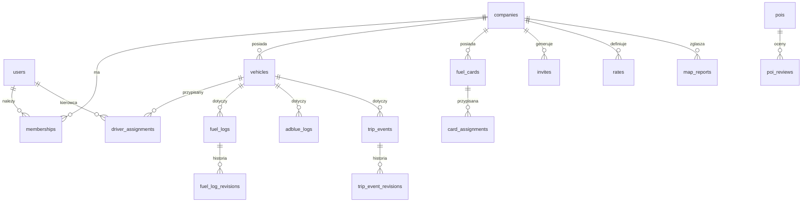

# 🧱 Model danych — E‑Logistic

> Status: **propozycja do akceptacji** · wersja 0.1.0 · 2026-06-20
> Baza: Supabase / **Postgres 17 + PostGIS**. Wszystkie tabele multi-tenant chronione **RLS**.

---

## 1. Diagram encji (skrót)

---

## 2. Role i multi-tenant

Tenant = **firma** (`company_id`). Rola w tabeli `memberships`.

| Rola | Zakres widoczności | Główne uprawnienia |
|:--|:--|:--|
| `developer` | globalny (audytowany) | diagnostyka, kontrola, naprawy, podgląd techniczny |
| `owner` | własna firma | pełne: pojazdy, kierowcy, karty (z PIN), stawki, statystyki, rozliczenia |
| `dispatcher` (spedytor) | własna firma | trasy, przypisania, statystyki operacyjne; **bez** PIN-ów kart |
| `driver` | własne rekordy | własne formularze (Paliwo/AdBlue/Trip), przypisany pojazd, mapa |

**Zasada RLS (skrót):** każdy `SELECT/INSERT/UPDATE` filtrowany przez `company_id`
z `memberships` zalogowanego użytkownika; kierowca dodatkowo ograniczony do
`driver_id = auth.uid()` na swoich formularzach.

---

## 3. Encje podstawowe

### `companies`
`id` (uuid) · `name` · `tax_id` (NIP/VAT) · `address` · `country` · `created_at`.

### `users` (rozszerza `auth.users`)
`id` · `full_name` · `phone` · `email` · `locale` · `mfa_enabled`.

### `memberships`
`id` · `company_id` · `user_id` · `role` (enum) · `status` (active/invited/disabled) · `created_at`.

### `vehicles` — *pełne dane z wymagań*
`id` · `company_id` · `registration` (np. WL5145U) · `model` · `year` ·
`first_registration_date` · `inspection_expiry` (przegląd) · `insurance_expiry` ·
`leasing_end` · `curb_weight` (waga auta) · `max_payload` (maks. ładunek) ·
`height_cm` · `width_cm` · `length_cm` · `vehicle_type` (enum) ·
`forwarder` (spedycja, pod którą jeździ) · `comment` · `created_at`.
> Pola wymiarów zasilają **profil pojazdu** w routingu TIR. Daty (przegląd/OC/leasing) →
> przyszłe przypomnienia (Faza 3+).

### `driver_assignments`
`id` · `vehicle_id` · `user_id` (kierowca) · `from`/`to` (okres) · `active`.
Kierowca: dane w `users` + `driver_profiles` (poniżej).

### `driver_profiles`
`user_id` · `company_name` (firma kierowcy) + `company_data` · `phone` · `email` ·
`qualifications` (jsonb: wózki widłowe, ADR, …) · `comment`.

### `fuel_cards` — *wszystkie istniejące karty + dane wrażliwe*
`id` · `company_id` · `provider` (enum: DKV, Eurowag, Shell, BP, Circle K, E100, UTA,
AS24, Aral, OMV, Routex, …) · `card_number_masked` · `pin_encrypted` (Vault/pgcrypto) ·
`valid_until` · `discount_percent` (rabat ustawiany przez ownera) · `notes`.
> **Bezpieczeństwo:** `pin_encrypted` widoczny tylko dla `owner` (RLS + szyfrowanie), audyt dostępu.

### `card_assignments`
`id` · `fuel_card_id` · `user_id` (osoba) · `vehicle_id` · `active`.
> Właściciel przypisuje osobę i pojazd do konkretnej karty.

---

## 4. Formularze (offline-first, niemutowalne + historia)

Każdy formularz: `id` (UUIDv7, klient) · `company_id` · `driver_id` · `vehicle_id` ·
`created_at` · `updated_at` · `synced_at` · `device_id` · `revision`. Edycja → wpis w `*_revisions`.

### `fuel_logs` — Formularz Paliwowy
`station_country` · `station_city` · `gps_lat` · `gps_lng` (auto z GPS lub ręcznie) ·
`odometer_km` · `liters` · `payment_method` (enum: card/cash) · `fuel_card_id` (nullable) ·
`price_total` (opcjonalnie) · `comment`.

### `adblue_logs` — Formularz AdBlue
Identyczna struktura jak `fuel_logs`, pole `liters` = AdBlue. Osobne statystyki per pojazd.

### `trip_events` — Formularz Trip
`action` (enum: `load`, `unload`, `start`, `end`, `service`, `other`) ·
`country` · `location` · `gps_lat` · `gps_lng` · `odometer_km` ·
`weight_kg` (załadunek/rozładunek) · `amount` (serwis, opcjonalne) · `comment`.

**Pola wg akcji (walidacja Zod warunkowa):**

| Akcja | Lokalizacja | KM | Waga | Kwota | Komentarz |
|:--|:--:|:--:|:--:|:--:|:--:|
| `load` (Załadunek) | ✅ | ✅ | ✅ | — | ✅ |
| `unload` (Rozładunek) | ✅ | ✅ | ✅ | — | ✅ |
| `start` (Rozpoczęcie) | ✅ | ✅ | — | — | ✅ |
| `end` (Zakończenie) | ✅ | ✅ | — | — | ✅ |
| `service` (Serwis) | ✅ | ✅ | — | ✅ (opc.) | ✅ (co naprawiono) |
| `other` (Inne) | ✅ | ✅ | — | opc. | ✅ (opis akcji) |

### `fuel_log_revisions`, `trip_event_revisions`
Pełna historia każdej edycji (kto, kiedy, poprzednie wartości) — wymóg historii + audyt.

---

## 5. Rozliczenia i statystyki

### `rates`
`id` · `company_id` · `vehicle_id` (nullable = domyślna) · `rate_per_km` ·
`currency` · `valid_from`.
> Stawka za km ustawiana przez ownera → podstawa wyliczenia zarobku z trasy.

### Silnik wyliczeń (`packages/core`, funkcje czyste)
Liczone z formularzy + odometru, **per pojazd**:

- **Spalanie paliwa** L/100km = Δlitry / Δkm między tankowaniami.
- **Spalanie AdBlue** analogicznie.
- **Efektywna cena paliwa** = cena − `discount_percent` karty.
- **Koszt trasy** = paliwo + AdBlue + serwis (kwoty z formularzy).
- **Przychód trasy** = przejechane km × `rate_per_km`.
- **Zysk z trasy** = przychód − koszt.
- **Uszkodzenia**: liczba + opis (z `trip_events.action='service'`/`other`) — co zepsute/naprawione.

> Wszystkie wzory deterministyczne i testowane jednostkowo — to „nośna" matematyka pieniędzy.

---

## 6. Mapa i POI

### `pois`
`id` · `type` (enum: parking, fuel_station, ferry, airport, company, wash, weigh) ·
`name` · `country` · `address` · `gps_lat` · `gps_lng` (PostGIS `geography`) ·
`amenities` (jsonb: truck_spaces, toilet, shower, restaurant, water, air_compressor) ·
`accepts` (jsonb: snap, travis, karty paliwowe) · `source` (osm/tpe/crowd) · `rating_avg`.

### `poi_reviews`
`id` · `poi_id` · `user_id` · `rating` · `safety` · `comment` · `created_at`.

### `fuel_prices`
`id` · `poi_id` (stacja) · `fuel_type` · `price` · `currency` · `reported_at` ·
`source` (crowd z `fuel_logs` / feed). → własna baza cen.

### `map_reports` — zgłoszenia społecznościowe
`id` · `type` (enum: accident, police, closure, traffic, weigh, hazard) ·
`gps_lat` · `gps_lng` · `reported_by` · `confidence` · `expires_at` · `votes`.
> Realtime broadcast (Supabase Realtime) do kierowców w pobliżu; zanik pewności w czasie.

---

## 7. Zaproszenia i audyt

### `invites`
`id` · `company_id` · `email`/`phone` · `vehicle_id` (do przypisania) · `role` ·
`token_hash` · `expires_at` · `accepted_at`.
> Generuje link + QR; wysyłka mail/SMS/WhatsApp; token przypisuje kierowcę do firmy+pojazdu.

### `audit_log`
`id` · `company_id` · `actor_id` · `action` · `target` · `meta` (jsonb) · `created_at`.
> Wymagany przy dostępie do PIN-ów i działaniach panelu developerskiego.

---

## 8. Indeksy i wydajność (zarys)

- PostGIS GIST na `pois.geography`, `map_reports` — zapytania „w pobliżu".
- Indeksy na `(company_id, vehicle_id, created_at)` dla formularzy (statystyki).
- Materializowane widoki agregatów statystyk (odświeżane przy synchronizacji).
