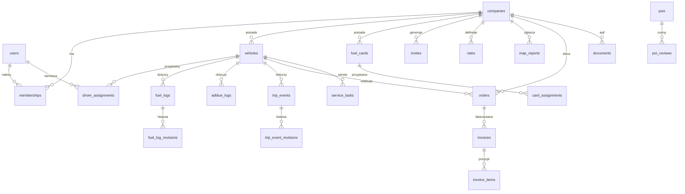

# 🧱 Model danych — E‑Logistic

> Status: **wdrożone** · stan kodu **v1.86.0** (#230) · 2026-06-28
> Baza: Supabase / **Postgres 17 + PostGIS + pgcrypto + Vault**. Wszystkie tabele multi-tenant chronione **RLS** (spójność weryfikowana automatycznie — [`scripts/audit-rls.mjs`](../scripts/audit-rls.mjs), patrz [SECURITY-RLS.md](SECURITY-RLS.md)).
> Sekcja „Aktualny schemat" niżej jest źródłem prawdy; dalsze rozdziały to oryginalny projekt (kontekst historyczny).

---

## 0. Aktualny schemat (stan v1.51.0 — migracje 0001–0051)

**~40 tabel `public` (wszystkie z RLS).** Poniżej rdzeń; sekcje 0.1–0.3 obejmują moduły dodawane kolejno (liczba tabel weryfikowana automatycznie — patrz [SECURITY-RLS.md](SECURITY-RLS.md) / `pnpm audit:rls`).

**Tabele:**
- `companies`, `memberships` (`role`, `status`, **`modules` text[]** — 0016), `profiles`, `driver_profiles`.
- `vehicles` — rejestracja, `make`/`model`/`year`/**`vin`** (0009), waga, `max_payload_kg`, **`fuel_tank_l`/`adblue_tank_l`** (0018), terminy `inspection_expiry`/`insurance_expiry`/`insurer` (0009)/`leasing_end`, **`license_number`** (0011), PostGIS `geo`.
- `driver_assignments` — przypisanie kierowca↔pojazd (RLS bez rekurencji: `is_assigned_to_vehicle` SECURITY DEFINER, 0014).
- `drivers` (kartoteka, 0012) — **tożsamość szyfrowana** `first_name_enc`/`last_name_enc`/`birth_date_enc` (0022) + dokumenty `id_card_enc`/`passport_enc`/`license_enc` (0015); `license_categories`/`qualifications` text[], `notes`.
- `fuel_cards` — `provider`, `card_number_masked`, **`pin_encrypted`** (pgcrypto+Vault, 0003), `discount`, `valid_until`, **`vehicle_id`/`registration`** (0011).
- `fuel_logs` / `adblue_logs` — `odometer_km`, `liters`, **`is_full`** (0017), `price_total`, `payment_method`, `fuel_card_id`, stacja + `geo`.
- `trip_events` — `action` (load/unload/start/end/service/other), `weight_kg`, `amount`, miejsce + `geo`.
- `vehicle_defects` (0019) — `part`/`side`/`severity`/`dashboard_light`/`description`/`status`/`resolved_by`.
- `notifications` (0017) — `type`/`title`/`body`/`severity`/`read_at`/`dedup_key` (`user_id`+`company_id`).
- `push_subscriptions` (0020, RLS `company_id` 0021) — `endpoint`/`p256dh`/`auth`.
- `passkeys` (0010) — WebAuthn (`credential_id`, `public_key`, `counter`).
- `invites` (0005) — token **hashowany** (SHA‑256), `role`, `vehicle_id`, `email_enc` (**szyfrowany** 0024); odczyt menedżera przez `list_invites()` (audytowane).
- `pois` / `poi_reviews` / `fuel_prices` (+ **`reported_by`** 0023) / `map_reports` — dane mapy/społeczności.
- `audit_log` — audyt dostępu do PIN/dokumentów/tożsamości.

**Kluczowe funkcje/RPC (SECURITY DEFINER):** `is_member_of`, `has_role`, `is_assigned_to_vehicle`,
`fuel_card_pin`/`set_fuel_card_pin`, `list_fuel_cards_for_user`, `driver_documents`/`driver_set_documents`,
**`list_drivers`/`driver_save`** (0022), `create_invite`/`accept_invite`, `notify_company`,
`generate_expiry_notifications`, `bootstrap_company`, `dev_stats`.

**Szyfrowanie:** PIN‑y kart, numery dokumentów oraz tożsamość kierowcy → `pgp_sym_encrypt` z kluczem
z **Vault** (`_card_key()`); dostęp tylko owner/dispatcher przez RPC, audytowany. `auth.users` (email/hasło)
szyfruje platforma Supabase.

> Uwaga porządkowa: numeracja migracji ma dwie kolizje historyczne (`0017_fuel_full_tank`+`0017_notifications`,
> `0018_fix_expiry_onconflict`+`0018_vehicle_tanks`) — kolejność wykonania alfabetyczna; do renumeracji w przyszłości.

### 0.1 Moduły dodane po v0.51 (migracje 0024–0040)

- **`service_tasks`** (0028) — zadania serwisowe per pojazd: `name`, `interval_km`, `last_done_km`; status liczony wg przebiegu (`serviceStatus` w core).
- **`orders`** (0029) — zlecenia/ładunki: `reference_no`, `shipper`, `consignee`, `origin`, `destination`, `cargo`, `weight_kg`, `price`, `currency`, `status` (enum `order_status`: new/assigned/in_progress/delivered/invoiced/cancelled), `vehicle_id`, **`assigned_to`** → `auth.users` (0032), `load_date`, `unload_date`, `notes`. RPC **`order_set_status`**: owner/dispatcher pełny zakres; przypisany kierowca tylko statusy operacyjne.
- **`invoices`** (0030) — faktury ze zlecenia lub puste: numeracja `FV/ROK/NNNN` per firma (blokada `pg_advisory_xact_lock`, bez luk), **snapshot sprzedawcy** (`seller_name`/`seller_tax_id`/`seller_address`, **`seller_bank`/`seller_account`** 0040), nabywca, `net`/`vat_rate`/`vat_amount`/`gross`, `currency`, **`status`** issued/cancelled (0037), **`due_date`** + domyślny VAT/termin z firmy (0038), **`paid_at`** (0039). RPC **`create_invoice`** (ze zlecenia → status `invoiced`), **`create_blank_invoice`** (0036), **`duplicate_invoice`** — wszystkie `SECURITY DEFINER` + `has_role(owner/dispatcher)`, zmiany audytowane.
- **`invoice_items`** (0034) — pozycje faktury: `position`/`description`/`quantity`/`unit_price`/`vat_rate`; kwoty pozycji (`net`/`vat_amount`/`gross`) liczone triggerem BEFORE, sumy faktury przeliczane triggerem AFTER z pozycji.
- **`documents`** (0031) — sejf dokumentów: prywatny bucket Storage `documents` (ścieżka `{company_id}/{uuid}-nazwa`), `name`/`category`/`size_bytes`/`expiry_date`/`vehicle_id`. RLS na `storage.objects` wiąże pierwszy segment ścieżki z `company_id` aktywnego członka; powiadomienia o wygasających dokumentach.
- **`companies`** rozszerzone: `default_vat_rate`, `payment_due_days` (0038), `bank_name`, `bank_account` (0040) — domyślne i dane do przelewu na fakturach.
- **`drivers`** + `user_id` (0035) — powiązanie kartoteki kierowcy z kontem (RPC `driver_link_user`; `list_drivers` zwraca `user_id`).

> **Analityka bez własnych tabel:** rentowność klientów (`clientProfitability`/`clientProfitTrend`) i alerty progowe (`fleetAlerts`) liczone są w `packages/core` z danych zleceń + paliwa + kosztów pojazdu (model atrybucji kosztu opisany w [#126]). Eksporty CSV i dwujęzyczność (PL/EN) po stronie web.

### 0.2 Moduły dodane po v1.4.0 (migracje 0042–0046)

- **`contractors`** (0042) — rejestr nabywców/nadawców per firma: `name`, `tax_id`, `address`, `country`; unikalność `(company_id, name)` pod upsert. Autouzupełnianie na fakturach i zleceniach; budowany organicznie. RLS: członek czyta, owner/dispatcher zarządza.
- **`vehicle_costs`** (0043) — koszty pojazdu **inne niż paliwo**: `vehicle_id`, `category` (repair/leasing/insurance/tax/fine/parking/tires/other), `amount`, `currency`, `cost_date`, `description`. Razem z kosztem paliwa zasilają **P&L floty** i atrybucję rentowności (`fleetPnl`, `sumCostsByCategory` w core). RLS: członek czyta, owner/dispatcher zarządza.
- **`order_photos`** (0044) — zdjęcia towaru przy zleceniu (dobrowolny dowód zabezpieczenia ładunku): `order_id`, `path`, `mime`, `size_bytes`, `caption`, `uploaded_by` (`default auth.uid()`). Prywatny bucket Storage `cargo-photos` (ścieżka `{company_id}/{order_id}/{uuid}`). RLS: członek czyta; **upload — każdy aktywny członek** (kierowca dokumentuje ładunek); kasowanie — owner/dispatcher (integralność dowodu). Storage.objects: folder[1] = company_id.
- **`saved_places`** (0045) — zapisane miejsca (ulubione POI floty: stacje paliw, porty, odprawy celne, firmy, parkingi): `name`, `category`, `lat`, `lng`, `created_by` (`default auth.uid()`). Współdzielone w firmie (zastępują lokalny `localStorage`); klik na mapie dodaje punkt do trasy + delta (`routeDelta` w core). RLS: członek czyta i dodaje; kasowanie — autor lub owner/dispatcher.
- **`expo_push_tokens`** (0046) — tokeny push Expo aplikacji mobilnej: `user_id`, `company_id`, `token` (unikalny), `platform`. Osobno od `push_subscriptions` (Web Push/VAPID). Każdy użytkownik zarządza własnymi (RLS `user_id = auth.uid()`); wysyłka serwerowa service-role przez Expo Push API (`/api/orders/notify-assignment`).

### 0.3 Moduły HR i ryzyka (migracje 0047–0051)

- **`per_diem_trips`** (0047) — ewidencja podróży do diet: `driver_name`, `destination`, `trip_date`, czas trwania i kwoty; trwała podstawa kalkulatora diet (`perDiem` w core) i zestawienia miesięcznego. RLS: członek czyta, owner/dispatcher zarządza.
- **`work_time_entries`** (0048) — ewidencja czasu pracy kierowcy: `driver_name`, `work_date`, godziny **jazdy / innej pracy / odpoczynku**, notatka. Podsumowania (sumy, średnia jazda/dzień, dni z przekroczeniem limitu) liczone `summarizeWorkTime` w core. RLS: członek czyta, owner/dispatcher zarządza.
- **`drivers.psychotech_expiry`** (0049) — nowa kolumna: termin badań **psychotechnicznych**. Wpięta w RPC `list_drivers`/`driver_save` oraz `generate_expiry_notifications` (przypomnienia obok prawa jazdy / kodu 95 / badań lekarskich / ADR).
- **`driver_payouts`** (0050) — rozliczenia kierowcy: `driver_name`, `type` (należność/zaliczka/potrącenie/wypłata), `amount`, `currency`, `entry_date`, notatka. Saldo do wypłaty per waluta liczone `settleDriverPayouts` w core (bez przeliczeń kursowych). RLS: członek czyta, owner/dispatcher zarządza.
- **`damage_claims`** (0051) — rejestr szkód / OC: `vehicle_id`, kierowca, `claim_date`, rodzaj (kolizja/kradzież/szyby/żywioł/wandalizm/inne), status (zgłoszona/w likwidacji/naprawiona/zamknięta/odrzucona), koszt, ubezpieczyciel, `claim_number`, opis. Podsumowanie (`summarizeDamageClaims` w core) zasila panel „Co wymaga uwagi" (otwarte szkody). RLS: multi-tenant.

> **Analityka i wykresy bez własnych tabel:** trend przychodu/kosztów/paliwa (`monthlyFleetTrend`, `fuelByMonth`) oraz globalne wyszukiwanie (`searchEntities`) liczone w `packages/core` z danych istniejących tabel; wizualizacja (`BarChart`/`RevenueTrend`) po stronie web.

---

## 1. Diagram encji (skrót)

---

## 2. Role i multi-tenant

Tenant = **firma** (`company_id`). Rola w tabeli `memberships`.

| Rola | Zakres widoczności | Główne uprawnienia |
|:--|:--|:--|
| `developer` | globalny (audytowany) | diagnostyka, kontrola, naprawy, podgląd techniczny |
| `owner` | własna firma | pełne: pojazdy, kierowcy, karty (z PIN), stawki, statystyki, rozliczenia |
| `dispatcher` (spedytor) | własna firma | trasy, przypisania, statystyki operacyjne; **bez** PIN-ów kart |
| `driver` | własne rekordy | własne formularze (Paliwo/AdBlue/Trip), przypisany pojazd, mapa |

**Zasada RLS (skrót):** każdy `SELECT/INSERT/UPDATE` filtrowany przez `company_id`
z `memberships` zalogowanego użytkownika; kierowca dodatkowo ograniczony do
`driver_id = auth.uid()` na swoich formularzach.

---

## 3. Encje podstawowe

### `companies`
`id` (uuid) · `name` · `tax_id` (NIP/VAT) · `address` · `country` · `created_at`.

### `users` / `profiles` (rozszerza `auth.users`)
`id` · `full_name_enc` · `phone_enc` · `email_enc` · `locale` · `mfa_enabled`.
> **PII szyfrowane at-rest** (0024): imię/telefon/e-mail jako `*_enc` (pgcrypto + Vault `pii_key`,
> odrębny od `card_key`). Kanoniczny e-mail i tak żyje w `auth.users`; `email_enc` to zaszyfrowana
> kopia zapisywana przez trigger rejestracji. Brak czytelników w aplikacji (zero ekspozycji jawnej).

### `memberships`
`id` · `company_id` · `user_id` · `role` (enum) · `status` (active/invited/disabled) · `created_at`.

### `vehicles` — *pełne dane z wymagań*
`id` · `company_id` · `registration` (np. WL5145U) · `model` · `year` ·
`first_registration_date` · `inspection_expiry` (przegląd) · `insurance_expiry` ·
`leasing_end` · `curb_weight` (waga auta) · `max_payload` (maks. ładunek) ·
`height_cm` · `width_cm` · `length_cm` · `vehicle_type` (enum) ·
`forwarder` (spedycja, pod którą jeździ) · `comment` · `created_at`.
> Pola wymiarów zasilają **profil pojazdu** w routingu TIR. Daty (przegląd/OC/leasing) →
> przyszłe przypomnienia (Faza 3+).

### `driver_assignments`
`id` · `vehicle_id` · `user_id` (kierowca) · `from`/`to` (okres) · `active`.
Kierowca: dane w `users` + `driver_profiles` (poniżej).

### `driver_profiles`
`user_id` · `company_name` (firma kierowcy) + `company_data_enc` · `phone_enc` · `email_enc` ·
`qualifications` (jsonb: wózki widłowe, ADR, …) · `comment`.
> PII (`phone`/`email`/`company_data`) **szyfrowane at-rest** (0024, `pii_key`).

### `fuel_cards` — *wszystkie istniejące karty + dane wrażliwe*
`id` · `company_id` · `provider` (enum: DKV, Eurowag, Shell, BP, Circle K, E100, UTA,
AS24, Aral, OMV, Routex, …) · `card_number_masked` · `pin_encrypted` (Vault/pgcrypto) ·
`valid_until` · `discount_percent` (rabat ustawiany przez ownera) · `notes`.
> **Bezpieczeństwo:** `pin_encrypted` (Vault/pgcrypto). Ustawia `owner` (`fuel_card_set_pin`); odczyt dla członków firmy (`fuel_card_pin` — kierowca płaci w automacie), audytowany.

### `card_assignments`
`id` · `fuel_card_id` · `user_id` (osoba) · `vehicle_id` · `active`.
> Właściciel przypisuje osobę i pojazd do konkretnej karty.

---

## 4. Formularze (offline-first, niemutowalne + historia)

Każdy formularz: `id` (UUIDv7, klient) · `company_id` · `driver_id` · `vehicle_id` ·
`created_at` · `updated_at` · `synced_at` · `device_id` · `revision`. Edycja → wpis w `*_revisions`.

### `fuel_logs` — Formularz Paliwowy
`station_country` · `station_city` · `gps_lat` · `gps_lng` (auto z GPS lub ręcznie) ·
`odometer_km` · `liters` · `payment_method` (enum: card/cash) · `fuel_card_id` (nullable) ·
`price_total` (opcjonalnie) · `comment`.

### `adblue_logs` — Formularz AdBlue
Identyczna struktura jak `fuel_logs`, pole `liters` = AdBlue. Osobne statystyki per pojazd.

### `trip_events` — Formularz Trip
`action` (enum: `load`, `unload`, `start`, `end`, `service`, `other`) ·
`country` · `location` · `gps_lat` · `gps_lng` · `odometer_km` ·
`weight_kg` (załadunek/rozładunek) · `amount` (serwis, opcjonalne) · `comment`.

**Pola wg akcji (walidacja Zod warunkowa):**

| Akcja | Lokalizacja | KM | Waga | Kwota | Komentarz |
|:--|:--:|:--:|:--:|:--:|:--:|
| `load` (Załadunek) | ✅ | ✅ | ✅ | — | ✅ |
| `unload` (Rozładunek) | ✅ | ✅ | ✅ | — | ✅ |
| `start` (Rozpoczęcie) | ✅ | ✅ | — | — | ✅ |
| `end` (Zakończenie) | ✅ | ✅ | — | — | ✅ |
| `service` (Serwis) | ✅ | ✅ | — | ✅ (opc.) | ✅ (co naprawiono) |
| `other` (Inne) | ✅ | ✅ | — | opc. | ✅ (opis akcji) |

### `fuel_log_revisions`, `trip_event_revisions`
Pełna historia każdej edycji (kto, kiedy, poprzednie wartości) — wymóg historii + audyt.

---

## 5. Rozliczenia i statystyki

### `rates`
`id` · `company_id` · `vehicle_id` (nullable = domyślna) · `rate_per_km` ·
`currency` · `valid_from`.
> Stawka za km ustawiana przez ownera → podstawa wyliczenia zarobku z trasy.

### Silnik wyliczeń (`packages/core`, funkcje czyste)
Liczone z formularzy + odometru, **per pojazd**:

- **Spalanie paliwa** L/100km = Δlitry / Δkm między tankowaniami.
- **Spalanie AdBlue** analogicznie.
- **Efektywna cena paliwa** = cena − `discount_percent` karty.
- **Koszt trasy** = paliwo + AdBlue + serwis (kwoty z formularzy).
- **Przychód trasy** = przejechane km × `rate_per_km`.
- **Zysk z trasy** = przychód − koszt.
- **Uszkodzenia**: liczba + opis (z `trip_events.action='service'`/`other`) — co zepsute/naprawione.

> Wszystkie wzory deterministyczne i testowane jednostkowo — to „nośna" matematyka pieniędzy.

---

## 6. Mapa i POI

### `pois`
`id` · `type` (enum: parking, fuel_station, ferry, airport, company, wash, weigh) ·
`name` · `country` · `address` · `gps_lat` · `gps_lng` (PostGIS `geography`) ·
`amenities` (jsonb: truck_spaces, toilet, shower, restaurant, water, air_compressor) ·
`accepts` (jsonb: snap, travis, karty paliwowe) · `source` (osm/tpe/crowd) · `rating_avg`.

### `poi_reviews`
`id` · `poi_id` · `user_id` · `rating` · `safety` · `comment` · `created_at`.

### `fuel_prices`
`id` · `poi_id` (stacja) · `fuel_type` · `price` · `currency` · `reported_at` ·
`source` (crowd z `fuel_logs` / feed). → własna baza cen.

### `map_reports` — zgłoszenia społecznościowe
`id` · `type` (enum: accident, police, closure, traffic, weigh, hazard) ·
`gps_lat` · `gps_lng` · `reported_by` · `confidence` · `expires_at` · `votes`.
> Realtime broadcast (Supabase Realtime) do kierowców w pobliżu; zanik pewności w czasie.

---

## 7. Zaproszenia i audyt

### `invites`
`id` · `company_id` · `email`/`phone` · `vehicle_id` (do przypisania) · `role` ·
`token_hash` · `expires_at` · `accepted_at`.
> Generuje link + QR; wysyłka mail/SMS/WhatsApp; token przypisuje kierowcę do firmy+pojazdu.

### `audit_log`
`id` · `company_id` · `actor_id` · `action` · `target` · `meta` (jsonb) · `created_at`.
> Wymagany przy dostępie do PIN-ów i działaniach panelu developerskiego.

---

## 8. Indeksy i wydajność (zarys)

- PostGIS GIST na `pois.geography`, `map_reports` — zapytania „w pobliżu".
- Indeksy na `(company_id, vehicle_id, created_at)` dla formularzy (statystyki).
- Materializowane widoki agregatów statystyk (odświeżane przy synchronizacji).
